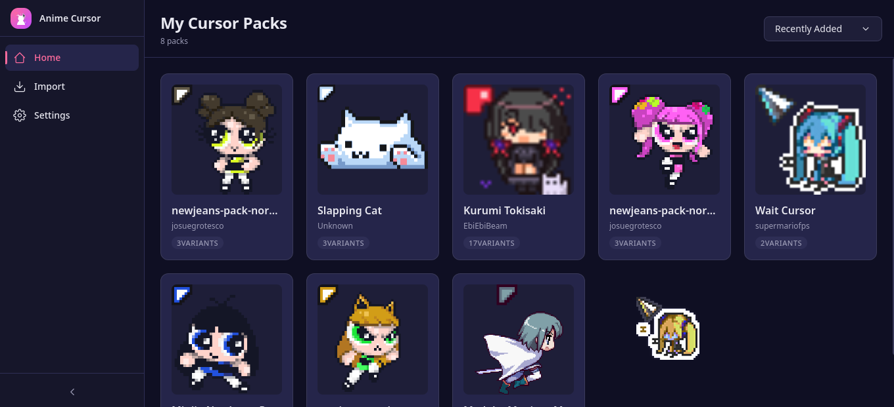
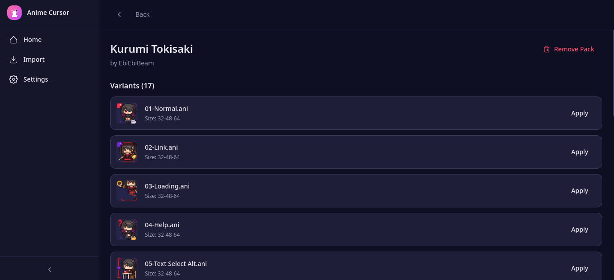
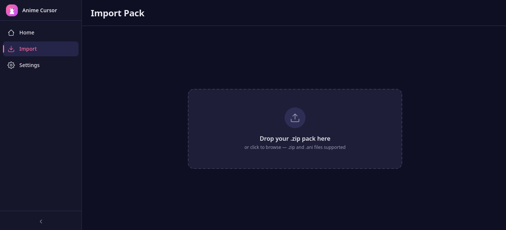
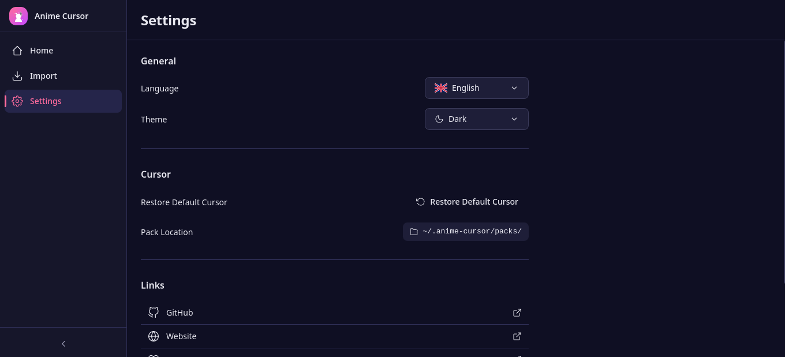

https://github.com/user-attachments/assets/6bcdc8f4-6b75-4bfb-a7d0-7de54b747782

<p align="center"></p>

<h1 align="center">Anime Cursor</h1>
<p align="center">
  <strong>Cross-Platform Desktop Animated Cursor Manager</strong>
</p>

<div align="center">

  <a href="https://github.com/Curzyori/anime-cursor"></a>
  <a href="https://github.com/Curzyori/anime-cursor/network/members"></a>
  <a href="https://github.com/Curzyori/anime-cursor/blob/main/LICENSE"></a>
  

</div>

<p align="center">
  <a href="#why">Why</a> ·
  <a href="#key-features">Features</a> ·
  <a href="#tech-stack">Tech Stack</a> ·
  <a href="#architecture">Architecture</a> ·
  <a href="#quick-start">Quick Start</a> ·
  <a href="#installation">Installation</a> ·
  <a href="#preview">Preview</a> ·
  <a href="#support">Support</a> ·
  <a href="#license">License</a>
</p>

<p align="center">
  🌐 In 4+ languages -
  <a href="README.md"><b>🇺🇸 EN</b></a> ·
  <a href="README_ID.md">🇮🇩 ID</a> ·
  <a href="README_CN.md">🇨🇳 CN</a> ·
  <a href="README_JP.md">🇯🇵 JP</a>
</p>

---

## <a id="why"></a>🕒 Why Anime Cursor?

Tired of digging through Control Panel or editing registry just to try an anime cursor pack? Anime Cursor is a cross-platform desktop app that makes browsing, importing, and applying animated cursor (.ani) packs dead simple - without hunting for Settings panels or writing terminal commands.

|                              |                                                              |
| ----------------------------- | ------------------------------------------------------------ |
| ✅ **One-Click Apply**       | Auto-detects your OS - no manual selection needed            |
| ✅ **Pack-Based Management**  | Import ZIPs with multiple cursor variants in one go          |
| ✅ **Auto Backup & Restore**  | Cursor backup before every apply - safe recovery anytime     |
| ✅ **Fully Offline**          | Zero network requests, zero telemetry - absolute privacy     |
| ✅ **Cross-Platform**         | Windows 10+ and Linux (GNOME, KDE, XFCE)                     |

## <a id="key-features"></a>🎯 Key Features

| Feature | Status | Description |
| :--- | :---: | :--- |
| **Pack Import** | ✅ | Drag-drop ZIP or individual .ani - auto-extract and parse |
| **Dashboard Grid** | ✅ | Browse all installed packs with sort by name/date |
| **Pack Detail View** | ✅ | Per-variant preview with apply button |
| **One-Click Apply** | ✅ | Auto OS detection - Windows registry or Linux Xcursor |
| **Auto Backup** | ✅ | Saves current cursor before every apply |
| **Restore Default** | ✅ | Revert to OS default cursor from Settings |
| **Multi-Language UI** | ✅ | EN, ID, CN, JP with one-click selector |
| **Dark/Light Theme** | ✅ | Persistent theme switcher |
| **Collapsible Sidebar** | ✅ | Icon-only compact mode |

## <a id="tech-stack"></a>🛠️ Tech Stack

- **Desktop Framework:** Tauri v2 (Rust + webview)
- **Frontend:** React 18 + TypeScript + Tailwind CSS
- **State:** Zustand (app state) + Tauri IPC (async commands)
- **Build:** Vite 6
- **Backend:** Rust (serde, zip, winreg, xcursor)
- **Format:** .ani RIFF animated cursor + .zip pack

## <a id="architecture"></a>🏗️ Architecture

```
anime-cursor/
├── src-tauri/           # Rust backend
│   ├── src/
│   │   ├── main.rs      # Tauri entry, commands
│   │   ├── parser.rs    # .ANI RIFF parser
│   │   ├── applier.rs   # Cursor apply/restore (Win + Linux)
│   │   ├── pack.rs      # ZIP extract, metadata read
│   │   └── backup.rs    # Cursor backup management
│   ├── icons/           # App icons per platform
│   └── Cargo.toml
├── src/                 # React frontend
│   ├── App.tsx
│   ├── pages/
│   │   ├── Dashboard.tsx
│   │   ├── Import.tsx
│   │   ├── PackDetail.tsx
│   │   └── Settings.tsx
│   ├── components/
│   ├── i18n/            # EN, ID, CN, JP language files
│   ├── hooks/
│   ├── styles/
│   └── types/
├── public/
│   └── logo.svg
├── .example/            # Reference cursor packs for testing
├── package.json
└── tauri.conf.json
```

## <a id="quick-start"></a>🚀 Quick Start

Download the latest release (recommended):

<a href="https://github.com/Curzyori/anime-cursor/releases">Download Anime Cursor →</a>

Supports .deb (Debian/Ubuntu), .rpm (Fedora), and .AppImage (all Linux).

## <a id="installation"></a>📦 Installation

Build from source (Node 18+):

```bash
git clone https://github.com/Curzyori/anime-cursor.git
cd anime-cursor
npm install
npm run tauri build
```

The binary will be at `src-tauri/target/release/anime-cursor`.

System dependencies (Linux):

```bash
sudo apt install libwebkit2gtk-4.1-dev libxdo-dev libayatana-appindicator3-dev
```

## <a id="preview"></a>🖼️ Preview

<div align="center">

| Dashboard | Pack Detail |
|-----------|-------------|
|  |  |
| Import | Settings |
|  |  |

</div>


## <a id="support"></a>☕ Support

If you find this project useful, please consider giving it a ⭐ Star or 🍴 Forking it to show support and keep me motivated to build more exciting open-source projects! Every single star and fork means a lot.

Your donations keep my projects free and open source. Every contribution matters, and your support helps me continue building exciting open-source projects in the future.

<a href="https://donate.curzy.dev/">Support this project by buying me a coffee! 💝</a>

<a href="https://donate.curzy.dev/">
  
</a>

## <a id="license"></a>⚖️ License

GPL-3.0 - see <a href="https://github.com/Curzyori/anime-cursor/blob/main/LICENSE">LICENSE</a>.

<p align="center">
  <sub>Built with passion as the 22nd project of the 50 Projects Challenge by **@Curzyori**</sub>
</p>
